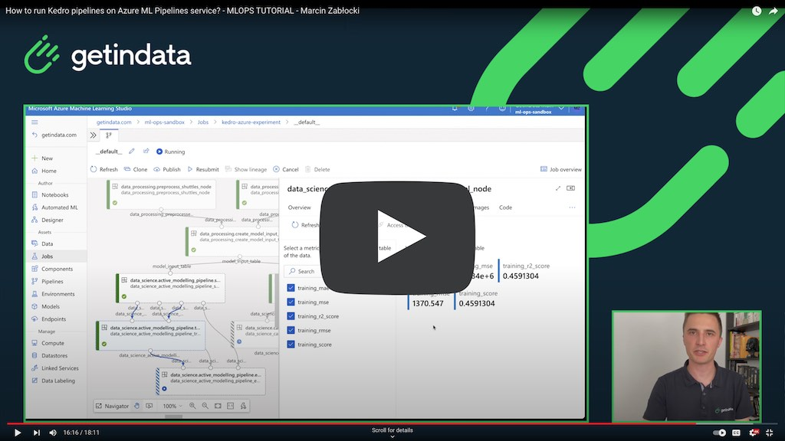

# Kedro Azure ML Pipelines plugin

[](https://github.com/getindata/kedro-azureml)
[](https://opensource.org/licenses/Apache-2.0)
[](https://semver.org/)
[](https://pypi.org/project/kedro-azureml/)
[](https://pepy.tech/project/kedro-azureml)

[](https://sonarcloud.io/summary/new_code?id=getindata_kedro-azureml)
[](https://sonarcloud.io/summary/new_code?id=getindata_kedro-azureml)
[](https://kedro-azureml.readthedocs.io/en/latest/?badge=latest)

<p align="center">
  <a href="https://getindata.com/solutions/ml-platform-machine-learning-reliable-explainable-feature-engineering"></a>
  <h3 align="center">We help companies turn their data into assets</h3>
</p>

## About
Following plugin enables running Kedro pipelines on Azure ML Pipelines service.

We support 2 native Azure Machine Learning types of workflows:
* For Data Scientists: fast, iterative development with code upload 
* For MLOps: stable, repeatable workflows with Docker 

## Documentation 

For detailed documentation refer to https://kedro-azureml.readthedocs.io/

## Usage guide

```
Usage: kedro azureml [OPTIONS] COMMAND [ARGS]...

Options:
  -e, --env TEXT  Environment to use.
  -h, --help      Show this message and exit.

Commands:
  compile  Compiles the pipeline into YAML format
  init     Creates basic configuration for Kedro AzureML plugin
  run      Runs the specified pipeline in Azure ML Pipelines
```

## Quickstart
Follow **quickstart** section on [kedro-azureml.readthedocs.io](https://kedro-azureml.readthedocs.io/) to get up to speed with plugin usage or watch the video below

<a href="https://bit.ly/kedroazureml">
    
</a>

