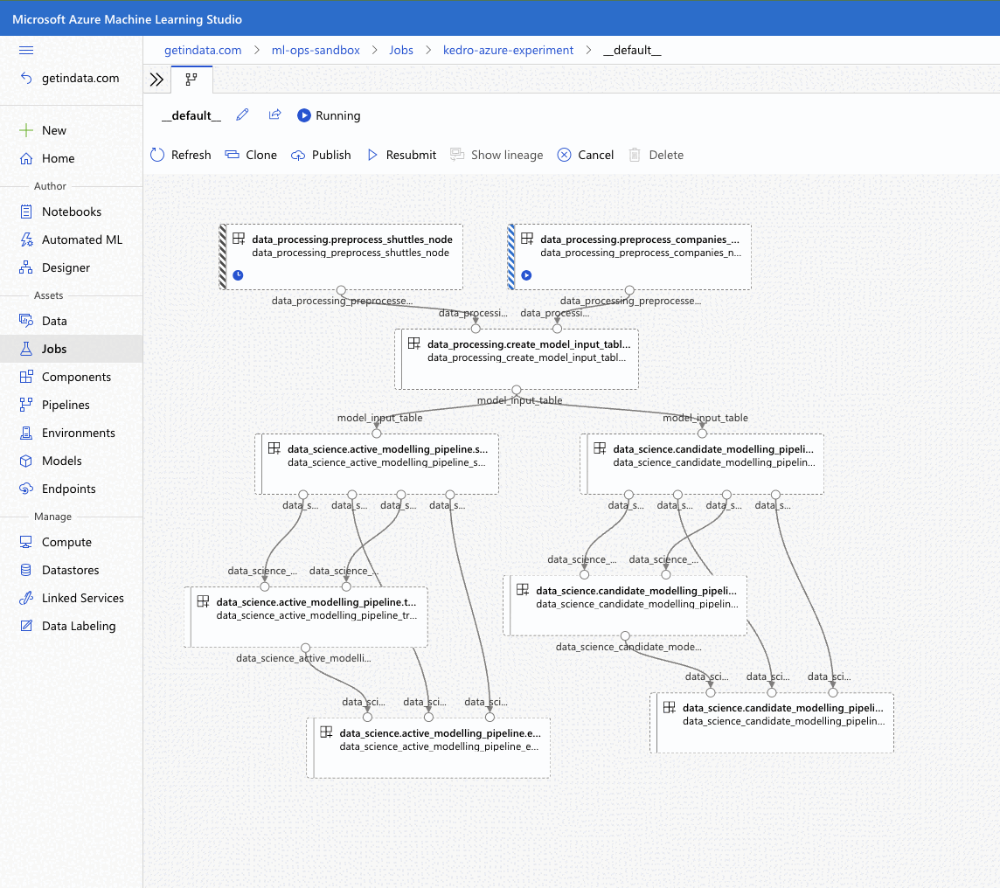
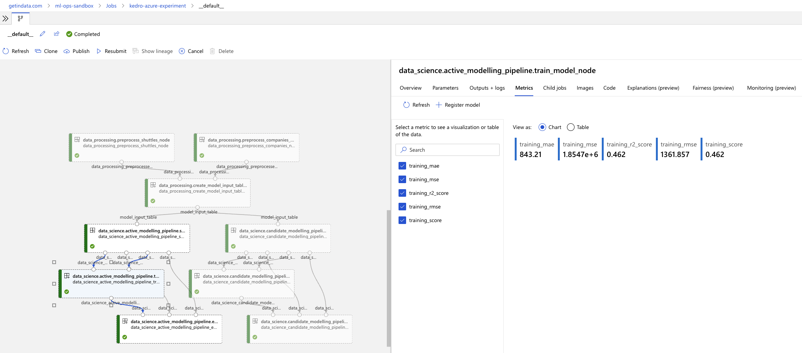

Quickstart
----------

You can go through the written quickstart here or watch the video on
YouTube:

.. raw:: html

   <iframe width="560" height="315" src="https://www.youtube-nocookie.com/embed/w_9RzYpGplY" title="YouTube video player" frameborder="0" allow="accelerometer; autoplay; clipboard-write; encrypted-media; gyroscope; picture-in-picture" allowfullscreen></iframe>

----

Before you start, make sure that you have the following resources
created in Azure and have their **names** ready to input to the plugin:

-  Azure Subscription ID
-  Azure Resource Group
-  Azure ML workspace
-  Azure ML Compute Cluster
-  Azure Storage Account and Storage Container
-  Azure Storage Key (will be used to execute the pipeline)
-  Azure Container Registry

1. Make sure that you're logged into Azure (``az login``).
2. Prepare new virtual environment with Python >=3.8. Install the
   packages

.. code:: console

   pip install "kedro>=0.18.2,<0.19" "kedro-docker" "kedro-azureml"

2. Create new project (e.g. from starter)

.. code:: console

   kedro new --starter=spaceflights

   Project Name
   ============
   Please enter a human readable name for your new project.
   Spaces, hyphens, and underscores are allowed.
    [Spaceflights]: kedro_azureml_demo

   The project name 'kedro_azureml_demo' has been applied to:
   - The project title in /Users/marcin/Dev/tmp/kedro-azureml-demo/README.md
   - The folder created for your project in /Users/marcin/Dev/tmp/kedro-azureml-demo
   - The project's python package in /Users/marcin/Dev/tmp/kedro-azureml-demo/src/kedro_azureml_demo

3. Go to the project's directory: ``cd kedro-azureml-demo``
4. Add ``kedro-azureml`` to ``src/requirements.txt``
5. (optional) Remove ``kedro-telemetry`` from ``src/requirements.txt``
   or set appropriate settings
   (`https://github.com/kedro-org/kedro-plugins/tree/main/kedro-telemetry <https://github.com/kedro-org/kedro-plugins/tree/main/kedro-telemetry>`__).
6. Install the requirements ``pip install -r src/requirements.txt``
7. Initialize Kedro Azure ML plugin, it requires the Azure resource
   names as stated above. Experiment name can be anything you like (as
   long as it's allowed by Azure ML). The environment name is the name
   of the Azure ML Environment to be created in the next steps. You can
   use the syntax ``<environment_name>@latest`` for the latest version or
   ``<environment-name>:<version>`` for a specific version.

.. code:: console

   #Usage: kedro azureml init [OPTIONS] SUBSCRIPTION_ID RESOURCE_GROUP WORKSPACE_NAME
   #                          EXPERIMENT_NAME CLUSTER_NAME STORAGE_ACCOUNT_NAME
   #                          STORAGE_CONTAINER ENVIRONMENT_NAME
   kedro azureml init <subscription-id> <resource-group-name> <workspace-name> <experiment-name> <compute-cluster-name> <storage-account-name> <storage-container-name> <environment-name>

8. Adjust the Data Catalog - the default one stores all data locally,
   whereas the plugin will automatically use Azure Blob Storage. Only
   input data is required to be read locally. Final
   ``conf/base/catalog.yml`` should look like this:

.. code:: yaml

   companies:
     type: pandas.CSVDataSet
     filepath: data/01_raw/companies.csv
     layer: raw

   reviews:
     type: pandas.CSVDataSet
     filepath: data/01_raw/reviews.csv
     layer: raw

   shuttles:
     type: pandas.ExcelDataSet
     filepath: data/01_raw/shuttles.xlsx
     layer: raw

9. Prepare an Azure ML Environment for the project:

   For the project's code to run on Azure ML it needs to have an environment
   with the necessary dependencies.

You have 2 options for executing your pipeline in Azure ML
    1. Use code upload (default) - more suitable for Data Scientists' experimentation and pipeline development
    2. Use docker image flow (shown in the Quickstart video) - more suitable for MLOps processes with better experiment repeatability guarantees

Start by executing the following command:

.. code:: console

   kedro docker init

This command creates a several files, including ``Dockerfile`` and
``.dockerignore``. These can be adjusted to match the workflow for
your project.

Depending on whether you want to use code upload when submitting an
experiment or not, you would need to add the code and any possible input
data to the Docker image.

9.1. **If using code upload** (default)

Everything apart from the section "install project requirements"
can be removed from the ``Dockerfile``. This plugin automatically creates empty ``.amlignore`` file (`see the official docs <https://learn.microsoft.com/en-us/azure/machine-learning/how-to-save-write-experiment-files#storage-limits-of-experiment-snapshots>`__)
which means that all of the files (including potentially sensitive ones!) will be uploaded to Azure ML. Modify this file if needed.

Ensure ``code_directory: "."`` is set in the ``azureml.yml`` config file (it's set by default).

.. collapse:: See example Dockerfile for code upload flow

    .. code-block:: dockerfile

        ARG BASE_IMAGE=python:3.9
        FROM $BASE_IMAGE

        # install project requirements
        COPY src/requirements.txt /tmp/requirements.txt
        RUN pip install -r /tmp/requirements.txt && rm -f /tmp/requirements.txt

\

\Build the image:

.. code:: console

    kedro docker build --docker-args "--build-arg=BASE_IMAGE=python:3.9" --image=<acr repo name>.azurecr.io/kedro-base-image:latest

\Login to ACR and push the image:

.. code:: console

    az acr login --name <acr repo name>
    docker push <acr repo name>.azurecr.io/kedro-base-image:latest

\Register the Azure ML Environment:

.. code:: console

    az ml environment create --name <environment-name> --image <acr repo name>.azurecr.io/kedro-base-image:latest

\
Now you can re-use this environment and run the pipeline without the need to build the docker image again (unless you add some dependencies to your environment, obviously :-) ).

.. warning::
    | Azure Code upload feature has issues with empty folders as identified in `GitHub #33 <https://github.com/getindata/kedro-azureml/issues/33>`__, where empty folders or folders with empty files might not get uploaded to Azure ML, which might result in the failing pipeline.
    | We recommend to:
    | - make sure that Kedro environments you intent to use in Azure have at least one non-empty file specified
    | - gracefully handle folder creation in your pipeline's code (e.g. if your code depends on an existence of some folder)
    |
    | The plugin will do it's best to handle some of the edge-cases, but the fact that some of your files might not be captured by Azure ML SDK is out of our reach.

9.2. **If using docker image flow** (shown in the Quickstart video)

.. note::
    | Note that using docker image flow means that every time you change your pipeline's code,
    | you will need to build and push the docker image to ACR again.
    | We recommend this option for CI/CD-automated MLOps workflows.

Ensure that in the ``azureml.yml`` you have ``code_directory`` set to null, and ``docker.image`` is filled:

.. code:: yaml

   code_directory: ~
   # rest of the azureml.yml file
   docker:
      image: your-container-registry.azurecr.io/kedro-azureml:latest

\
Keep the sections in the ``Dockerfile`` and adjust the ``.dockerignore``
file to include any other files to be added to the Docker image,
such as ``!data/01_raw`` for the raw data files.

Invoke docker build:

.. code:: console

   kedro docker build --docker-args "--build-arg=BASE_IMAGE=python:3.9" --image=<image tag from conf/base/azureml.yml>

\Once finished, login to ACR:

.. code:: console

    az acr login --name <acr repo name>

\and push the image:

.. code:: console

   docker push <image tag from conf/base/azureml.yml>

10. Run the pipeline on Azure ML Pipelines. Here, the *Azure Subscription ID* and *Storage Account Key* will be used:

.. code:: console

   kedro azureml run -s <azure-subscription-id>

You will most likely see the following prompt:

.. code:: console

   Environment variable AZURE_STORAGE_ACCOUNT_KEY not set, falling back to CLI prompt
   Please provide Azure Storage Account Key for storage account <azure-storage-account>:

Input the storage account key and press [ENTER] (input will be hidden).

11. Plugin will verify the configuration (e.g. the existence of the
    compute cluster) and then it will create a *Job* in the Azure ML.
    The URL to view the job will be displayed in the console output.

12. (optional) You can also use
    ``kedro azureml run -s <azure-subscription-id> --wait-for-completion``
    to actively wait for the job to finish. Execution logs will be
    streamed to the console.

.. code:: console

   RunId: placid_pot_bdcyntnkvn
   Web View: https://ml.azure.com/runs/placid_pot_bdcyntnkvn?wsid=/subscriptions/<redacted>/resourcegroups/<redacted>/workspaces/ml-ops-sandbox

   Streaming logs/azureml/executionlogs.txt
   ========================================

   [2022-07-22 11:45:38Z] Submitting 2 runs, first five are: 1ee5f43f:8cf2e387-e7ec-44cc-9615-2108891153f7,7d81aeeb:c8b837a9-1f79-4971-aae3-3191b29b42e8
   [2022-07-22 11:47:02Z] Completing processing run id c8b837a9-1f79-4971-aae3-3191b29b42e8.
   [2022-07-22 11:47:25Z] Completing processing run id 8cf2e387-e7ec-44cc-9615-2108891153f7.
   [2022-07-22 11:47:26Z] Submitting 1 runs, first five are: 362b9632:7867ead0-b308-49df-95ca-efa26f8583cb
   [2022-07-22 11:49:27Z] Completing processing run id 7867ead0-b308-49df-95ca-efa26f8583cb.
   [2022-07-22 11:49:28Z] Submitting 2 runs, first five are: 03b2293e:e9e210e7-10ab-4010-91f6-4a40aabf3a30,4f9ccafb:3c00e735-cd3f-40c7-9c1d-fe53349ca8bc
   [2022-07-22 11:50:50Z] Completing processing run id e9e210e7-10ab-4010-91f6-4a40aabf3a30.
   [2022-07-22 11:50:51Z] Submitting 1 runs, first five are: 7a88df7a:c95c1488-5f55-48fa-80ce-971d5412f0fb
   [2022-07-22 11:51:26Z] Completing processing run id 3c00e735-cd3f-40c7-9c1d-fe53349ca8bc.
   [2022-07-22 11:51:26Z] Submitting 1 runs, first five are: a79effc8:0828c39a-6f02-43f5-acfd-33543f0d6c74
   [2022-07-22 11:52:38Z] Completing processing run id c95c1488-5f55-48fa-80ce-971d5412f0fb.
   [2022-07-22 11:52:39Z] Submitting 1 runs, first five are: 0a18d6d6:cb9c8f61-e129-4394-a795-ab70be74eb0f
   [2022-07-22 11:53:03Z] Completing processing run id 0828c39a-6f02-43f5-acfd-33543f0d6c74.
   [2022-07-22 11:53:04Z] Submitting 1 runs, first five are: 1af5c8de:2821dc44-3399-4a26-9cdf-1e8f5b7d6b62
   [2022-07-22 11:53:28Z] Completing processing run id cb9c8f61-e129-4394-a795-ab70be74eb0f.
   [2022-07-22 11:53:51Z] Completing processing run id 2821dc44-3399-4a26-9cdf-1e8f5b7d6b62.

   Execution Summary
   =================
   RunId: placid_pot_bdcyntnkvn

|Kedro AzureML Pipeline execution|

MLflow integration
------------------

The plugin is compatible with ``mlflow`` (but not yet with
``kedro-mlflow``). You can use native mlflow logging capabilities
provided by Azure ML. See the guide here:
`https://docs.microsoft.com/en-us/azure/machine-learning/how-to-use-mlflow-cli-runs?tabs=azuremlsdk <https://docs.microsoft.com/en-us/azure/machine-learning/how-to-use-mlflow-cli-runs?tabs=azuremlsdk>`__.

There is no additional configuration for MLflow required in order to use
it with Azure ML pipelines. All the settings are provided automatically
by the Azure ML service.

|Kedro AzureML MLflow integration|

------------

Using a different compute cluster for specific nodes
------------------

For certain nodes it can make sense to run them on a different
compute clusters (e.g. High Memory or GPU). This can be achieved
using `Node tags <https://kedro.readthedocs.io/en/stable/kedro.pipeline.node.html>`_
and adding additional compute targets in your ``azureml.yml``.

After creating an additional compute cluster in your AzureML workspace,
in this case the additional cluster is called ``cpu-cluster-8``,
we can add it in our ``azureml.yml`` under an alias (in this case ``chunky``).

.. code:: console

  compute:
    __default__:
      cluster_name: "cpu-cluster"
    chunky:
      cluster_name: "cpu-cluster-8"

Now we are able to reference this compute target in our kedro pipelines using kedro node tags:

.. code:: console

        [
            node(
                func=preprocess_companies,
                inputs="companies",
                outputs="preprocessed_companies",
                name="preprocess_companies_node",
                tags=["chunky"]
            ),
            node(
                func=preprocess_shuttles,
                inputs="shuttles",
                outputs="preprocessed_shuttles",
                name="preprocess_shuttles_node",
            ),
            node(
                func=create_model_input_table,
                inputs=["preprocessed_shuttles", "preprocessed_companies", "reviews"],
                outputs="model_input_table",
                name="create_model_input_table_node",
                tags=["chunky"]
            ),
        ],

When running our project, ``preprocess_companies`` and ``create_model_input_table``
will be run on ``cpu-cluster-8`` while all other nodes are run on the default ``cpu-cluster``.

Distributed training
------------------

The plugins supports distributed training via native Azure ML distributed orchestration, which includes:

- MPI - https://learn.microsoft.com/en-us/azure/machine-learning/how-to-train-distributed-gpu#mpi
- PyTorch - https://learn.microsoft.com/en-us/azure/machine-learning/how-to-train-distributed-gpu#pytorch
- TensorFlow - https://learn.microsoft.com/en-us/azure/machine-learning/how-to-train-distributed-gpu#tensorflow

If one of your Kedro's pipeline nodes requires distributed training (e.g. you train a neural network with PyTorch), you can mark the node with ``distributed_job`` decorator from ``kedro_azureml.distributed.decorators`` and use native Kedro parameters to specify the number of nodes you want to spawn for the job.
An example for PyTorch looks like this:

.. code:: python

    #                    | use appropriate framework
    #                   \|/                      \/ specify the number of distributed nodes to spawn for the job
    @distributed_job(Framework.PyTorch, num_nodes="params:num_nodes")
    def train_model_pytorch(
        X_train: pd.DataFrame, y_train: pd.Series, num_nodes: int, max_epochs: int
    ):
        # rest of the code
        pass

In the ``pipeline`` you would use this node like that:

.. code:: python

    node(
        func=train_model_pytorch,
        inputs=["X_train", "y_train", "params:num_nodes", "params:max_epochs"],
        outputs="regressor",
        name="train_model_node",
    ),

and that's it!
The ``params:`` you use support namespacing as well as overriding at runtime, e.g. when launching the Azure ML job:

.. code:: console

    kedro azureml run -s <subscription id> --params '{"data_science": {"active_modelling_pipeline": {"num_nodes": 4}}}'

The ``distributed_job`` decorator also supports "hard-coded" values for number of nodes:

.. code:: python

    @distributed_job(Framework.PyTorch, num_nodes=2) # no need to use Kedro params here
    def train_model_pytorch(
        X_train: pd.DataFrame, y_train: pd.Series, num_nodes: int, max_epochs: int
    ):
        # rest of the code
        pass

We have tested the implementation heavily with PyTorch (+PyTorch Lightning) and GPUs. If you encounter any problems, drop us an issue on GitHub!

Run customization
-----------------

In case you need to customize pipeline run context, modifying configuration files is not always the most convinient option. Therefore, ``kedro azureml run`` command provides a few additional options you may find useful:

- ``--subscription_id`` overrides Azure Subscription ID,
- ``--azureml_environment`` overrides the configured Azure ML Environment,
- ``--image`` modifies the Docker image used during the execution,
- ``--pipeline`` allows to select a pipeline to run (by default, the ``__default__`` pipeline is started),
- ``--params`` takes a JSON string with parameters override (JSONed version of ``conf/*/parameters.yml``, not the Kedro's ``params:`` syntax),
- ``--env-var KEY=VALUE`` sets the OS environment variable injected to the steps during runtime.
